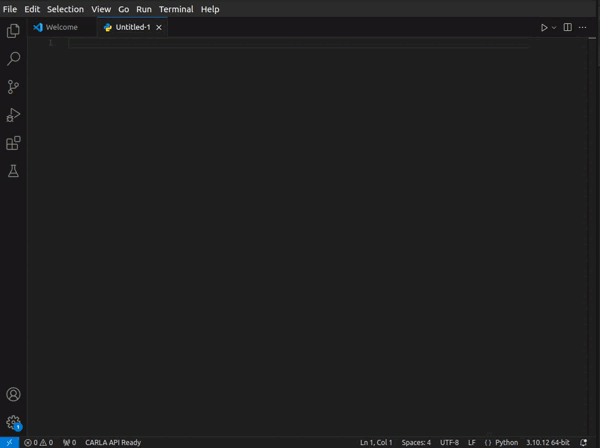

# CARLA API Extension for Visual Studio Code

This extension provides intelligent code completion, documentation, and IntelliSense support for the CARLA autonomous driving simulator API in Visual Studio Code.

## Features

### Intelligent Code Completion
- Context-aware completion for CARLA classes, methods, and properties
- Automatically shows relevant methods and properties when typing class names
- Rich documentation preview in completion items



### Method Signature Help
- Real-time parameter information while typing method calls
- Parameter types and default values
- Documentation for each parameter

### Hover Documentation
- Detailed documentation on hover for classes, methods, and properties
- Shows method signatures and return types
- Displays access information for properties (read/write)

### Smart Context Detection
- Shows only relevant completions based on context
- Class suggestions when starting a new statement
- Method and property suggestions only for the current class being typed

## Requirements

- Visual Studio Code version 1.94.0 or higher
- Python extension for VS Code
- CARLA Python API installed in your environment (optional)

## Installation

1. Install the extension through VS Code:
   - Open VS Code
   - Go to Extensions (Ctrl+Shift+X)
   - Search for "CARLA API"
   - Click Install

2. Alternatively, download the VSIX file and install manually:
   ```bash
   code --install-extension carlaapi-0.0.1.vsix
   ```

## Usage

The extension activates automatically when editing Python files. Here's how to use the main features:

1. **Class Completion**
   - Start typing a CARLA class name
   - Press Ctrl+Space to see available classes
   
2. **Method and Property Completion**
   - Type a class name followed by a dot (e.g., `Actor.`)
   - Completions will automatically show available methods and properties
   
3. **Signature Help**
   - Type an opening parenthesis after a method name
   - Signature help will show parameter information
   - Use commas to navigate through parameters

## Examples

```python
# The extension will provide completions and documentation
world = client.get_world()  # Shows World class methods
actor = world.spawn_actor()  # Shows spawn_actor parameters
```

## Known Issues

- Method overloads are currently not supported
- Some complex type hints might not be parsed correctly
- Documentation might be incomplete for some CARLA API methods

## Troubleshooting

If you encounter any issues:

1. Ensure you have the latest version of VS Code installed
2. Check that the Python extension is installed and configured
3. Verify that your CARLA Python API is properly installed
4. Try reloading VS Code if completions don't appear

## Contributing

1. Fork the repository

``` bash
   git clone  https://github.com/misarb/carlaApiExtension
```

2. Create a feature branch
3. Commit your changes
4. Push to the branch
5. Create a Pull Request

## Release Notes

### 0.0.1 - Initial Release
- Basic completion for CARLA API classes
- Method and property suggestions
- Signature help
- Hover documentation
- Context-aware completions

## Planned Features

- Support for method overloads
- Improved type hint parsing
- Integration with CARLA documentation
- Quick actions for common CARLA operations
- Code snippets for common patterns

## License

This extension is licensed under the MIT License. See the LICENSE file for details.

## Acknowledgments

- CARLA Simulator team for their excellent documentation
- VS Code extension development community

## Support

For bug reports and feature requests, please use the GitHub issue tracker:

[https://github.com/misarb/carlaApiExtension/issues](https://github.com/misarb/carlaApiExtension/issues)

---
## Buy me a Coffee : 
[paypal](paypal.me/LBoulbalah)

**Enjoy using the CARLA API Extension!**
